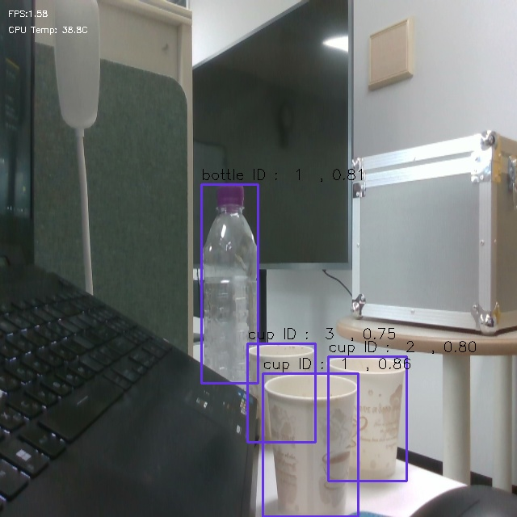
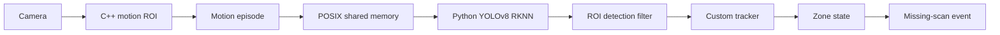

# RK3588 Edge Vision — 상품 스캔 누락 감지 파이프라인

카메라에서 상품의 움직임을 찾고, RK3588 NPU 객체 인식과 custom tracker를 결합해 지정 영역 통과 여부를 판단하는 엣지 비전 프로젝트다. 포트폴리오에서는 회사·협업사 정보 없이 문제, 구현, 실험 근거와 설계 진화를 중심으로 정리했다.

## 문제 정의

무인 계산 환경에서는 카메라에 상품이 보이는 것만으로 정상 스캔 여부를 알 수 없다. 필요한 것은 다음 세 정보를 한 흐름에서 연결하는 일이다.

- 어떤 상품이 화면에 들어왔는가
- 상품이 시간에 따라 어떤 경로로 이동했는가
- 사라지기 전에 지정된 스캔 영역을 통과했는가

이 프로젝트는 detector의 단일-frame 인식을 움직임 ROI 및 track 상태와 결합한다. track이 지정 영역을 한 번도 통과하지 않은 채 사라지면 missing-scan event를 만든다.

## 핵심 결과

| 항목 | 결과 | 의미 |
|---|---:|---|
| 상품 테스트 | **2,683 / 2,981** | timestamp별 최고 confidence가 정답 class인 frame 수 |
| 가중 correct-class ratio | **0.9000** | 10개 익명 상품 전체 집계 |
| C++ pipeline | **9 workers** | capture, motion, episode, IPC, filter, tracking 분리 |
| process boundary | **C++ ↔ Python** | POSIX shared memory와 semaphore로 frame/detection 교환 |
| 공개 소스 | **17 files / SHA-256 고정** | 원본 최신 구현을 내용 수정 없이 선별 |

`0.9000`은 mAP나 객체 단위 recall이 아니라 timestamp 단위 최고-confidence 정답 class 비율이다. 계산 정의와 상품별 편차는 [상품 테스트 요약](results/product_test_summary.md)에 공개했다.

## 시스템 구조

최신 기본 경로는 `src/cpp/run.cpp`의 `run_2()`다. C++ worker 9개가 SPSC queue로 연결되고, Python은 RKNN 출력의 box/class branch를 decode해 `x1, y1, x2, y2, confidence, class_id` 배열을 반환한다.

[아키텍처 상세 보기](docs/ARCHITECTURE.md)

## 구현 범위

- V4L2 카메라 frame capture와 OpenCV frame-difference motion path 구성
- threshold, morphology, contour filtering, 겹치는 ROI 병합 구현
- C++/Python 프로세스 사이의 shared-memory layout과 semaphore 동기화 구성
- YOLOv8 RKNN 출력 tensor 후처리 및 detection 직렬화
- 중심 거리, IoU, box 면적 비율, class history를 결합한 custom tracker 구현
- 지정 영역 진입 상태와 track 소멸을 이용한 missing-scan rule 구현
- YOLOv5/YOLOv8, nano/small, 단일/다중 모델의 처리량·메모리 비교
- 상품별 frame 로그를 최고-confidence class 기준으로 집계

## 핵심 설계 판단

### 범용 MOT보다 도메인 상태를 직접 추적

선행 EdgeMOT에서 SORT의 ID switch와 DeepSORT의 엣지 CPU 비용을 확인했다. 최종 경로는 별도 embedding model 대신 네 가지 저비용 조건 중 두 개 이상을 만족하는 detection을 연결하고, 스캔 영역 진입 상태를 track에 직접 보존한다.

### detector와 motion을 경쟁시키지 않고 결합

frame difference는 “움직인 위치”를, YOLO는 “상품 class”를 제공한다. ROI center와 가장 가까운 detection만 tracker에 전달해 정지 배경 검출이 상태 판단에 섞이는 것을 줄였다.

### NPU 코드와 제어 코드를 프로세스로 분리

RKNN 후처리는 Python에서 빠르게 교정하고, frame 수명주기와 tracker는 C++에 유지했다. 모델을 바꾸더라도 detection array 계약은 그대로 사용할 수 있다.

[의사결정 전체 보기](docs/ENGINEERING_DECISIONS.md)

## 기술 스택

| 영역 | 기술 |
|---|---|
| Edge hardware | RK3588 NPU board |
| Vision | OpenCV, V4L2 |
| Inference | YOLOv8, RKNN Runtime |
| Runtime | C++17, Python, NumPy |
| IPC | POSIX shared memory, semaphore, `mmap` |
| Concurrency | `std::thread`, SPSC queue |
| Tracking | motion ROI + rule-based association + zone state |

## 코드 읽는 순서

1. [`src/cpp/run.cpp`](src/cpp/run.cpp) — 최신 9-worker 조립과 기본 진입점
2. [`src/cpp/LaborManager.cpp`](src/cpp/LaborManager.cpp) — motion, ROI, inference, filter, tracker worker
3. [`src/cpp/define.h`](src/cpp/define.h) — detection/track 상태와 event rule
4. [`src/cpp/SharedMemoryManager.hpp`](src/cpp/SharedMemoryManager.hpp) — C++ 측 IPC 계약
5. [`src/python/ipc_python.py`](src/python/ipc_python.py) — Python 측 frame 수신과 detection 송신
6. [`src/python/yolo8_rknn.py`](src/python/yolo8_rknn.py) — RKNN 실행과 YOLOv8 후처리

## 실험 자료

| 문서 | 내용 |
|---|---|
| [실험 기록과 해석](docs/EXPERIMENTS.md) | tracker 전환, RKNN 후처리, 다중 모델 실험의 연결 |
| [모델 비교](results/model_benchmark.md) | YOLOv5/v8 FPS, 인식률 기록, 목표와 측정값 구분 |
| [메모리 비교](results/memory_benchmark.md) | 단일·다중·class-split 모델의 메모리/처리량 기록 |
| [상품 테스트](results/product_test_summary.md) | 10개 상품 2,981 frame의 계산 정의와 class별 편차 |
| [프로젝트 타임라인](docs/PROJECT_TIMELINE.md) | EdgeMOT 탐색부터 custom tracker 통합까지의 변화 |

## 선행 프로젝트와의 관계

[CNN-SORT Customization](https://github.com/SaDubu/CNN_SORT_Customization)은 RK3588에서 SORT, appearance feature, cosine similarity를 조합한 선행 실험이다. MOT15에서 IDF1 33.1%, MOTA 24.8%를 기록했고, 그 결과가 범용 re-identification보다 상품 이동 규칙에 맞춘 가벼운 tracker로 전환하는 근거가 됐다.

두 저장소는 역할이 다르다.

- CNN-SORT Customization: 범용 tracker와 NPU appearance 연산 탐색
- 이 저장소: motion ROI, 상품 detector, custom tracker, zone event를 통합한 도메인 시스템

## 공개 범위와 원본성

이 저장소는 기존 대형 개발 저장소를 그대로 복제한 것이 아니라, 기준 커밋에서 최신 핵심 소스만 내용 수정 없이 가져온 포트폴리오 스냅샷이다.

- 회사·협업사 명칭, 개인 이메일, 내부 사업 자료 제외
- 데이터셋, 모델, 바이너리, 캐시, 원시 frame 로그 제외
- 원본 경로와 파일별 SHA-256 기록
- 목표 수치와 관찰/집계 결과 분리

자세한 기준은 [Source manifest](SOURCE_MANIFEST.md)와 [공개 범위 문서](docs/PRIVACY_AND_ATTRIBUTION.md)에서 확인할 수 있다.

## 라이선스와 제3자 코드

RKNN Model Zoo 기반 코드와 외부 참고 자료는 [Third-party notices](THIRD_PARTY_NOTICES.md)에 정리했다. `LFQSPSC.h`는 기술 블로그의 SPSC queue 설계를 참고한 재배포 가능 구현으로 출처를 기록했다.
