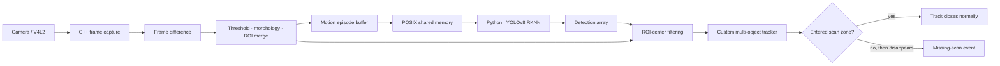

# 시스템 아키텍처

이 프로젝트는 RK3588 기반 엣지 장치에서 카메라 프레임의 움직임 영역을 찾고, NPU 객체 인식 결과와 결합해 상품의 이동 경로와 지정 영역 통과 여부를 추적하는 구조다. 최신 기본 진입점은 `src/cpp/run.cpp`의 `run_2()`다.

## 전체 흐름

카메라와 프레임 제어, 움직임 처리, 추적은 C++이 담당하고 RKNN 런타임 호출과 YOLOv8 후처리는 Python이 담당한다. 두 프로세스는 프레임과 검출 배열만 교환하므로 추론부와 실시간 제어부를 독립적으로 수정할 수 있다.

## 최신 9-worker 파이프라인

`run_2()`는 작업을 다음 9개 worker로 나눈다.

| 순서 | worker | 입력 → 출력 | 역할 |
|---:|---|---|---|
| 1 | `capture_worker` | camera → `display_q` | V4L2 프레임 획득 |
| 2 | `sendFrame_g` | `tunnel` → `raw_q` | 화면 경로의 프레임을 분석 경로로 복제 |
| 3 | `dmr_worker` | `raw_q` → frame/ROI queues | grayscale frame difference와 움직임 box 생성 |
| 4 | `distribution_worker` | frame/ROI → archive/list | 움직임 구간을 파일 단위 episode로 묶음 |
| 5 | `RGB_draw_worker` | frame/ROI → `final_q` | 화면을 3개 영역으로 나눠 motion center 표시 |
| 6 | `get_image_move_area` | episode list → frame/ROI | 저장된 프레임과 ROI 좌표를 추론 경로로 공급 |
| 7 | `yolo_worker` | frame → shared memory → detections | Python RKNN 프로세스와 프레임/결과 교환 |
| 8 | `filter_worker` | detections + ROI → candidates | ROI center에 가장 가까운 검출을 선택 |
| 9 | `track_worker` | candidates → tracks/events | 규칙 기반 association, 이동 예측, 영역 통과 판정 |

worker 사이에는 `LockFreeQueueSPSC<T>`를 사용한다. 큐 구현은 cache-line 정렬된 head/tail과 acquire/release ordering으로 producer와 consumer 사이의 전달을 구성한다.

## 움직임 영역 생성

`MotionDetector`와 `LaborManager`의 움직임 경로는 다음 순서로 동작한다.

1. 현재 프레임을 grayscale로 변환한다.
2. 직전 프레임과 `absdiff`를 계산한다.
3. threshold 50으로 binary mask를 만든다.
4. 30×30 사각 kernel로 dilation 후 erosion을 적용한다.
5. 전체 contour 면적이 10,000 미만이면 움직임이 없는 것으로 처리한다.
6. 면적 10,000 이상 contour의 bounding box를 만들고, 겹치는 box를 합친다.

이 단계는 detector를 대체하지 않는다. 영상 전체에서 나온 detector 후보를 실제로 움직인 영역과 대응시켜 추적 입력을 줄이는 역할을 한다.

## C++ ↔ Python IPC 계약

### 프레임 채널

- 공유 메모리 이름: `/<base>_shm`
- 기본 frame contract: 640×480×3, uint8 RGB
- 동기화: `/<base>_empty`, `/<base>_full` POSIX semaphore
- 종료 신호: `/<base>_exit`

### 검출 결과 채널

- 공유 메모리 이름: `/<base>_yolo`
- 동기화: `/<base>_yolo_sem`
- sequence: uint16 + 2-byte padding
- count: int32
- detection: float32 6개 (`x1, y1, x2, y2, confidence, class_id`)
- 최대 검출 수: 100

Python은 RKNN 출력을 decode/NMS한 뒤 위 배열로 보내고, C++은 sequence가 달라졌을 때만 새 결과를 읽는다.

## 추적과 누락 이벤트 규칙

tracker association은 다음 네 조건 중 두 개 이상을 만족한 후보를 고르고, 그중 IoU가 가장 높은 track과 연결한다.

- 예상 중심과 검출 중심의 거리: 100 px 이내
- IoU: 0.5 이상
- 현재 box와 track 평균 box 면적 비율: 0.5 이상
- 최근 다수결 class와 현재 class가 같음

연결되면 중심 이동량으로 속도 `vx`, `vy`를 갱신하고, 연결되지 않은 track은 속도로 다음 위치를 예측한다. 최근 30개 class와 box 면적을 history로 보존하며, 최대 30회의 missing count를 넘긴 track은 정리한다.

판정 영역은 소스 기준 `x=213..426`이다. track 중심이 이 영역에 한 번이라도 들어오면 `checked_in=true`가 되고, 영역을 통과하지 않은 track이 사라질 때 missing-scan event를 출력한다.

## 코드 경계

| 디렉터리 | 책임 |
|---|---|
| `src/cpp` | 카메라, 움직임, 큐, 공유 메모리, tracker, event rule |
| `src/python` | RKNN 모델 실행, YOLOv8 후처리, 결과 직렬화, 로그 집계 |
| `configs` | 공개 가능한 중립 class mapping 예시 |
| `results` | 측정 정의와 근거 수준을 명시한 결과 요약 |
| `models` | 비공개 모델을 별도로 준비하기 위한 계약 설명 |

## 정적 리뷰에서 확인한 후속 보강점

원본 구현을 그대로 보존했기 때문에 다음 항목은 포트폴리오 문서에서 후속 개선 대상으로 추적한다.

- 검출 shared-memory 크기에 sequence와 count header 8바이트가 모두 반영되는지 경계값 테스트
- `m_is_running` 포인터를 loop condition에서 역참조하도록 종료 경로 일관화
- 각 SPSC queue가 정확히 producer 1개, consumer 1개를 갖는지 ownership 표로 고정
- episode 파일 저장 경로를 메모리 ring buffer와 비교해 I/O 지연 측정
- POSIX shared-memory 권한 `0666`을 배포 계정 범위로 축소

이 항목은 스냅샷에서 코드를 조용히 고치지 않고, 원본성과 개선 과제를 동시에 보이기 위해 문서화했다.
