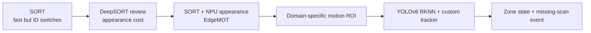

# 프로젝트 타임라인

날짜는 두 코드 저장소의 Git 이력과 개발 기록을 기준으로 묶었다. 원래 commit message가 작업 내용을 충분히 설명하지 않는 구간은 파일별 변경 시점과 문서 내용을 함께 사용했다.

| 기간 | 단계 | 핵심 결과 |
|---|---|---|
| 2025-09-17 — 2025-10-24 | 선행 EdgeMOT 실험 | RK3588 NPU detector, SORT/DeepSORT 비교, appearance feature 검증, MOT15 평가 |
| 2026-01-26 | SMOF 시작 | 소형 상품 이동과 지정 영역 통과를 다루는 별도 저장소 시작 |
| 2026-01-29 — 2026-02-06 | RKNN detector 통합 | YOLOv8 RKNN 후처리, C++/Python shared-memory IPC, 모델 비교 반복 |
| 2026-02-25 — 2026-03-13 | motion/ROI 파이프라인 | frame difference, morphology, ROI merge, episode 저장·재공급 경로 구성 |
| 2026-03-03 — 2026-03-25 | custom tracker | 거리·IoU·box 비율·class history association과 지정 영역 판정 구현 |
| 2026-03-25 — 2026-03-26 | 최신 통합 경로 | `run_2()` 9-worker 파이프라인과 상품 class 집계 정리 |
| 2026-08-22 | 포트폴리오 스냅샷 | 회사명 익명화, 핵심 소스 선별, 결과 정의·출처·해시 문서화 |

## 설계 진화

온라인 저장소 소개에 남아 있는 “SORT + Optical Flow” 표현은 탐색 단계의 방향을 설명한다. 최신 기본 `run_2()`는 optical flow가 아니라 frame difference와 custom association을 사용하므로, 이 포트폴리오는 구현 기준으로 두 단계를 구분한다.
